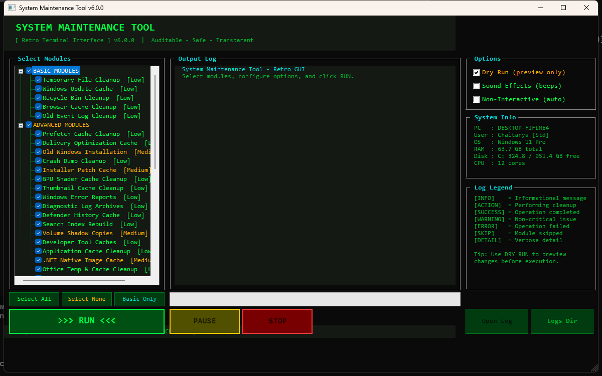
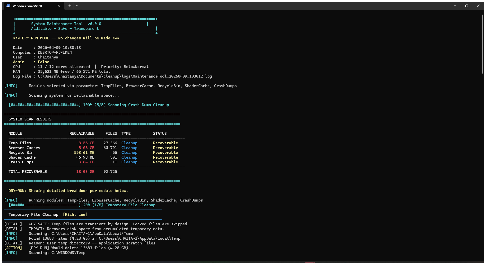
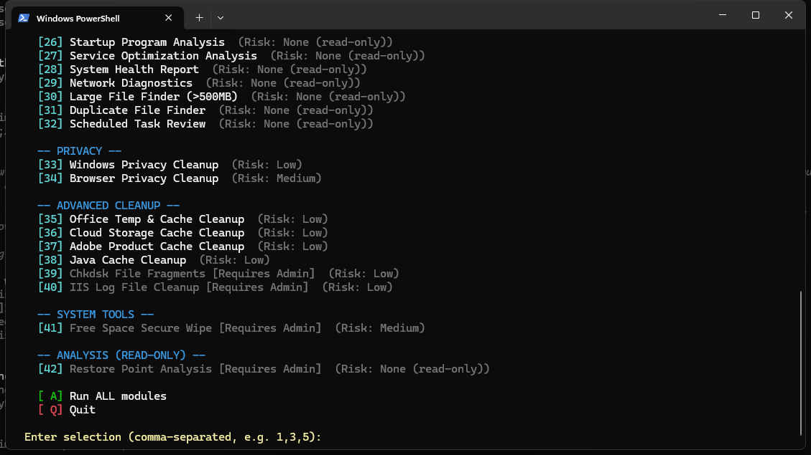

<div align="center">

# System Maintenance Tool

### Open-Source Windows Cleanup & Optimization

**42 Modules** &bull; **7 Browsers** &bull; **4 Interfaces** &bull; **Sound FX** &bull; **Full Audit Trail**

[](#requirements)
[](#requirements)
[](LICENSE)
[](#version-history)

*A safe, transparent, and auditable alternative to CCleaner, BleachBit, and FCleaner.*
*Every action is logged. Every deletion is explained. Nothing runs without your approval.*

---

### GUI Interface



### CLI - Scan Results Table



### CLI - Module Selection Menu



</div>

---

## Table of Contents

- [Quick Start](#quick-start)
- [Screenshots](#screenshots)
- [Features at a Glance](#features-at-a-glance)
- [Interfaces](#interfaces)
- [Module Reference](#module-reference)
- [Browser Support](#browser-support)
- [Safety Guarantees](#safety-guarantees)
- [Execution Policy](#execution-policy)
- [Command-Line Parameters](#command-line-parameters)
- [Output Format](#output-format)
- [Logging & Audit Trail](#logging--audit-trail)
- [GUI Controls](#gui-controls)
- [Resource Management](#resource-management)
- [Managed Deployment](#managed-deployment)
- [What This Tool Does NOT Do](#what-this-tool-does-not-do)
- [Requirements](#requirements)
- [Project Structure](#project-structure)
- [Building from Source](#building-from-source)
- [FAQ](#faq)
- [Contributing](#contributing)
- [License](#license)
- [Version History](#version-history)

---

## Quick Start

### Option 1: Run the Script

```powershell
# Allow script execution for this session (no permanent changes)
Set-ExecutionPolicy -ExecutionPolicy Bypass -Scope Process

# Preview what would be cleaned (safe -- nothing is changed)
.\SystemMaintenanceTool.ps1 -DryRun

# Interactive mode with full menu
.\SystemMaintenanceTool.ps1
```

### Option 2: Run the Executable

No PowerShell configuration needed. Download from the `build/` folder:

| File | Architecture | Use Case |
|------|:------------:|----------|
| `SystemMaintenanceTool-x64.exe` | 64-bit | Most modern PCs (Intel/AMD) |
| `SystemMaintenanceTool-x86.exe` | 32-bit | Older or 32-bit systems |
| `SystemMaintenanceTool-AnyCPU.exe` | Any | ARM64 / universal fallback |

```cmd
SystemMaintenanceTool-x64.exe -DryRun
```

### Option 3: Launch the GUI

```powershell
.\SystemMaintenanceGUI.ps1
# -- or use the prebuilt GUI executable --
.\build\SystemMaintenanceGUI-x64.exe
```

### Option 4: Retro TUI

```powershell
.\SystemMaintenanceTool.ps1 -RetroUI
```

### Option 5: With Sound Effects

```powershell
.\SystemMaintenanceTool.ps1 -Sound          # CLI with sounds
.\SystemMaintenanceTool.ps1 -RetroUI -Sound  # TUI with sounds
```

> **Note:** Windows SmartScreen may warn on first run of `.exe` files. Right-click the file > Properties > check **Unblock**, then click OK.

---

## Screenshots

### WinForms GUI — Retro CRT Terminal


Three-panel layout with retro green-on-black CRT styling:
- **Left:** Module tree with checkboxes grouped by category (Basic, Advanced, Privacy, Tools, Analysis)
- **Center:** Live Output Log with color-coded entries (auto-scrolling)
- **Right:** Options (Dry Run, Sound, Non-Interactive), System Info, and Log Legend
- **Bottom:** RUN / PAUSE / RESUME / STOP controls with progress bar

### CLI — Pre-Scan Results Table


Before any cleanup begins, the tool scans your system and displays a summary table showing:
- Reclaimable space per module (in GB/MB)
- File counts
- Module type and recovery status
- **Total reclaimable** across all selected modules

### CLI — Interactive Module Menu


Color-coded module selection with risk levels and category grouping. Enter module numbers (comma-separated), `A` for all, or `Q` to quit.

---

## Features at a Glance

| Feature | Details |
|---------|---------|
| **42 cleanup & analysis modules** | Across 5 categories: Basic, Advanced, Privacy, Tools, Analysis |
| **Pre-scan summary table** | Shows all reclaimable space before any action is taken |
| **Dry-run mode** | Preview everything with `-DryRun` -- zero changes made |
| **7 browser support** | Chrome, Edge, Firefox, Opera, Brave, Vivaldi, Waterfox |
| **4 interfaces** | CLI menu, Retro TUI, WinForms GUI, non-interactive mode |
| **Pause / Resume / Stop** | GUI supports real-time process control during scans |
| **Sound effects** | Optional retro beeps for progress, success, and errors |
| **Full audit trail** | Timestamped `.log` + machine-readable `.csv` per session |
| **Resource management** | Auto-limits CPU and RAM usage to avoid starving your system |
| **Prebuilt executables** | 6 `.exe` files (3 CLI + 3 GUI) for x64, x86, and AnyCPU |
| **Zero dependencies** | Ships with Windows -- nothing to install |

---

## Interfaces

| Interface | Command | Description |
|:---------:|---------|-------------|
| **CLI** | `.\SystemMaintenanceTool.ps1` | Interactive numbered menu with category grouping |
| **Retro TUI** | `.\SystemMaintenanceTool.ps1 -RetroUI` | Full-screen green-on-black Norton Commander style. Arrow keys, Space to toggle, A to select all, Enter to run, Esc to exit |
| **GUI** | `.\SystemMaintenanceGUI.ps1` | WinForms window with retro CRT styling, tree-based module selection, centered live log, progress bar, Pause/Resume/Stop controls |
| **Headless** | `.\SystemMaintenanceTool.ps1 -NonInteractive` | Fully automated for scheduled tasks and scripting |

All interfaces support the `-DryRun` and `-Sound` switches.

---

## Module Reference

### Basic Cleanup (5 modules)

| Module | What It Cleans | Risk | Admin |
|--------|----------------|:----:|:-----:|
| **TempFiles** | Windows & user temp directories (files >2 days old) | Low | No |
| **WindowsUpdate** | Cached update packages in SoftwareDistribution | Low | Yes |
| **RecycleBin** | Empties the Recycle Bin | Low | No |
| **BrowserCache** | Cache files for 7 browsers (Chromium + Gecko engines) | Low | No |
| **EventLogs** | Oversized (>50 MB) non-security event logs | Low | Yes |

### Advanced Cleanup (22 modules)

| Module | What It Cleans | Risk | Admin |
|--------|----------------|:----:|:-----:|
| **PrefetchCleanup** | Windows Prefetch (.pf) files | Low | Yes |
| **DeliveryOptimization** | Windows Update P2P delivery cache | Low | Yes |
| **WindowsOldCleanup** | Previous Windows installation (Windows.old) | Medium | Yes |
| **CrashDumps** | Memory dumps, minidumps, LiveKernelReports | Low | Yes |
| **InstallerCleanup** | Orphaned installer patch cache ($PatchCache$) | Medium | Yes |
| **ShaderCache** | GPU shader caches (NVIDIA, AMD, DirectX, Intel) | Low | No |
| **ThumbCacheCleanup** | Thumbnail and icon cache databases | Low | No |
| **ErrorReporting** | Windows Error Reporting queued/archived reports | Low | Yes |
| **WindowsLogFiles** | CBS, DISM, Panther diagnostic logs | Low | Yes |
| **DefenderCache** | Windows Defender scan history and quarantine | Low | Yes |
| **SearchIndexCleanup** | Resets corrupted or oversized Search index | Low | Yes |
| **ShadowCopyCleanup** | Old Volume Shadow Copies (keeps most recent) | Medium | Yes |
| **DevToolCaches** | npm, NuGet, pip, cargo, Go, Maven, Gradle | Low | No |
| **AppCacheCleanup** | Teams, Spotify, Discord, VS Code, Slack caches | Low | No |
| **DotNetCleanup** | .NET NGen cache and ASP.NET temp files | Low | Yes |
| **FontCacheRebuild** | Rebuilds font cache (fixes rendering issues) | Low | Yes |
| **OfficeCleanup** | Microsoft Office & LibreOffice temp/cache files | Low | No |
| **CloudStorageCleanup** | OneDrive, Google Drive, Dropbox, iCloud log caches | Low | No |
| **AdobeCleanup** | Adobe Acrobat and Creative Cloud cache files | Low | No |
| **JavaCleanup** | Java deployment cache, WebStart temp, logs | Low | No |
| **ChkdskFragments** | Orphaned `.chk` fragments from disk checks | Low | Yes |
| **IISLogCleanup** | IIS web server logs older than 30 days | Low | Yes |

### Privacy Cleanup (2 modules)

| Module | What It Cleans | Risk | Admin |
|--------|----------------|:----:|:-----:|
| **WindowsPrivacyCleanup** | Recent docs, jump lists, Run MRU, typed paths, clipboard, app MRU (RDP, RegEdit, Paint, WordPad, Media Player) | Low | No |
| **BrowserPrivacyCleanup** | Cookies, history, sessions, form data for all 7 browsers. **Warning: this logs you out of all sites.** | Medium | No |

### System Tools (6 modules)

| Module | Action | Risk | Admin |
|--------|--------|:----:|:-----:|
| **DiskCleanup** | Invokes built-in Windows `cleanmgr` | Low | Yes |
| **ComponentStoreCleanup** | DISM `/StartComponentCleanup` on WinSxS | Low | Yes |
| **DNSCacheFlush** | Flushes the DNS resolver cache | Low | Yes |
| **WindowsStoreCache** | Resets Microsoft Store cache via `wsreset` | Low | No |
| **FontCacheRebuild** | Stops font cache service, deletes cache, restarts | Low | Yes |
| **FreeSpaceWiper** | Securely wipes free disk space via `cipher.exe /w:` | Medium | Yes |

### Analysis -- Read-Only (8 modules)

These modules **never modify anything**. They produce reports only.

| Module | Reports On |
|--------|------------|
| **StartupAnalysis** | Startup programs with enable/disable recommendations |
| **ServiceAnalysis** | Running services that may be unnecessary |
| **SystemHealthCheck** | Disk health, RAM usage, uptime, error counts, top memory consumers |
| **NetworkAnalysis** | Adapters, DNS config, connectivity, active TCP connections |
| **LargeFileFinder** | Files >500 MB with size, location, and age |
| **DuplicateFileFinder** | Duplicate files in Documents, Desktop, Downloads (by MD5 hash) |
| **ScheduledTaskReview** | Third-party and suspicious scheduled tasks |
| **RestorePointAnalysis** | System restore points and shadow copy storage usage |

---

## Browser Support

Both **BrowserCache** and **BrowserPrivacyCleanup** modules detect and clean all installed browsers:

| Browser | Engine | Cache | Cookies | History | Sessions | Form Data |
|---------|:------:|:-----:|:-------:|:-------:|:--------:|:---------:|
| Google Chrome | Chromium | ✔ | ✔ | ✔ | ✔ | ✔ |
| Microsoft Edge | Chromium | ✔ | ✔ | ✔ | ✔ | ✔ |
| Mozilla Firefox | Gecko | ✔ | ✔ | ✔ | ✔ | ✔ |
| Opera | Chromium | ✔ | ✔ | ✔ | ✔ | ✔ |
| Brave | Chromium | ✔ | ✔ | ✔ | ✔ | ✔ |
| Vivaldi | Chromium | ✔ | ✔ | ✔ | ✔ | ✔ |
| Waterfox | Gecko | ✔ | ✔ | ✔ | ✔ | ✔ |

> Chromium-based browsers share a common profile path structure. Firefox/Waterfox use profile directories matched via `*.default*` glob.

---

## Safety Guarantees

| Safeguard | How It Works |
|-----------|-------------|
| **Pre-scan table** | Scans the entire system and shows a summary table of reclaimable space *before* any action |
| **Dry-run mode** | `-DryRun` simulates every action and reports what *would* happen -- nothing is touched |
| **Confirmation prompts** | Every destructive action requires explicit `Y/N` approval |
| **Double confirmation** | Medium-risk modules (WindowsOld, InstallerCleanup, ShadowCopy, FreeSpaceWiper) ask twice |
| **Locked file handling** | In-use files are detected and skipped gracefully |
| **Full audit trail** | Every action is logged to both a human-readable `.log` and a structured `.csv` file |
| **No registry cleaning** | Zero registry modifications -- they cause more problems than they solve |
| **No user file deletion** | Only system and application caches are targeted |
| **No fake optimizations** | No "RAM freeing", "internet booster", or placebo tweaks |
| **Rollback guidance** | Where possible, log entries explain how to undo an action |

---

## Execution Policy

Windows may block PowerShell scripts by default. Choose one approach:

```powershell
# Option 1: Bypass for this session only (recommended)
Set-ExecutionPolicy -ExecutionPolicy Bypass -Scope Process

# Option 2: Allow scripts for your user account (persists across sessions)
Set-ExecutionPolicy -ExecutionPolicy RemoteSigned -Scope CurrentUser

# Option 3: Inline bypass (no settings change)
powershell.exe -ExecutionPolicy Bypass -File .\SystemMaintenanceTool.ps1 -DryRun

# Option 4: Use the .exe build (bypasses execution policy entirely)
.\build\SystemMaintenanceTool-x64.exe -DryRun
```

> **Tip:** For deployment via Intune, SCCM, or other endpoint management tools, use `-ExecutionPolicy Bypass` in the scheduled task definition.

---

## Command-Line Parameters

| Parameter | Type | Description |
|-----------|------|-------------|
| `-DryRun` | Switch | Preview all actions without making changes |
| `-Modules` | String[] | Run only specific modules (comma-separated) |
| `-SkipModules` | String[] | Skip specific modules |
| `-NonInteractive` | Switch | No prompts -- uses safe defaults (for automation) |
| `-LogPath` | String | Custom directory for log files |
| `-Sound` | Switch | Enable retro beep sound effects |
| `-RetroUI` | Switch | Launch the full-screen retro TUI interface |

### Examples

```powershell
# Dry run: preview everything
.\SystemMaintenanceTool.ps1 -DryRun

# Run only browser and temp cleanup
.\SystemMaintenanceTool.ps1 -Modules TempFiles,BrowserCache,BrowserPrivacyCleanup

# Run everything except privacy modules
.\SystemMaintenanceTool.ps1 -SkipModules WindowsPrivacyCleanup,BrowserPrivacyCleanup

# Full automated run with custom log path
.\SystemMaintenanceTool.ps1 -NonInteractive -LogPath "C:\Logs\Maintenance"

# Retro TUI with sound
.\SystemMaintenanceTool.ps1 -RetroUI -Sound
```

---

## Output Format

All interfaces use color-coded status prefixes:

| Prefix | Color | Meaning |
|--------|:-----:|---------|
| `[INFO]` | Cyan | Informational -- scanning, counting, reporting |
| `[ACTION]` | Yellow | An action is about to be performed |
| `[SUCCESS]` | Green | Action completed successfully |
| `[WARNING]` | Amber | Non-critical issue (e.g., requires admin elevation) |
| `[ERROR]` | Red | Action failed -- details included |
| `[SKIP]` | Gray | Module or path skipped (not found, not applicable) |
| `[DETAIL]` | Gray | Safety rationale, rollback guidance, tips |

### Sample Output

```
=== MODULE: Temporary File Cleanup (Risk: Low) ===
[INFO]    Scanning Windows temp, user temp, and TMP directories...
[INFO]    WHAT:   Removes temporary files older than 2 days.
[INFO]    WHY:    Temp files accumulate and waste disk space.
[INFO]    IMPACT: Low risk -- only stale files are removed.
[INFO]    Found 1,247 files (892.4 MB) across 3 temp directories.
[ACTION]  Deleting 892.4 MB of temp files...
[SUCCESS] Removed 1,241 files. 6 skipped (in use). Freed 889.1 MB.
```

---

## Logging & Audit Trail

Every run automatically creates two files in `logs/` (or your custom `-LogPath`):

| File | Format | Purpose |
|------|:------:|---------|
| `MaintenanceTool_YYYYMMDD_HHmmss.log` | Text | Full human-readable session log |
| `MaintenanceTool_YYYYMMDD_HHmmss_actions.csv` | CSV | Structured log for Excel, SIEM, or compliance import |

### CSV Schema

```
Timestamp, Module, Action, Target, Result, BytesFreed, FilesAffected, DryRun
```

### Session Header (logged automatically)

```
Session started. Version=6.1.0 DryRun=True Admin=True
Resources: CPU=11/12 cores, RAM=37554/65271 MB, Priority=BelowNormal
Modules selected: TempFiles, BrowserCache, RecycleBin, ...
```

---

## GUI Controls

The WinForms GUI (`SystemMaintenanceGUI.ps1`) provides:

| Control | Function |
|---------|----------|
| **Module Tree** | Left panel -- check/uncheck modules by category |
| **Output Log** | Center panel -- live color-coded log output (auto-scrolling) |
| **Options Panel** | Right panel -- Dry Run toggle, Sound toggle, system info |
| **RUN** | Starts the selected modules |
| **PAUSE** | Suspends the running cleanup process (Win32 `SuspendThread`) |
| **RESUME** | Resumes a paused cleanup process |
| **STOP** | Terminates the running process immediately |
| **Progress Bar** | Shows approximate completion percentage |
| **Open Log** | Opens the session log file after completion |

### GUI Architecture

The GUI runs the main script as a **child process** with redirected output. Output is captured via .NET's `OutputDataReceived` async event into a thread-safe `ConcurrentQueue`, then drained by a UI timer. This design ensures the GUI **never freezes** during long scans, pauses, or cancellation.

---

## Resource Management

The tool automatically limits its own resource usage:

| Resource | Behavior |
|----------|----------|
| **CPU Priority** | Child process runs at `BelowNormal` -- your apps always come first |
| **CPU Affinity** | On 4+ core systems, cleanup is pinned to cores `0..N-2`, leaving the last core free for OS and GUI |
| **Memory** | Garbage collection triggered between modules when working set exceeds 512 MB |
| **Disk I/O** | File operations use streaming reads -- no bulk loading into memory |

---

## Managed Deployment

For endpoint management (Intune, SCCM, Ansible, etc.):

1. Deploy `SystemMaintenanceTool.ps1` (or the `.exe`) to a shared path
2. Create a scheduled task running as `SYSTEM`
3. Use `-NonInteractive` mode with a central `-LogPath`
4. Aggregate `.csv` logs via your SIEM for compliance dashboards

```powershell
# Example: Monthly maintenance task
$action = New-ScheduledTaskAction -Execute 'powershell.exe' `
    -Argument '-ExecutionPolicy Bypass -File "C:\Tools\SystemMaintenanceTool.ps1" -NonInteractive -LogPath "C:\Logs\Maintenance"'
$trigger = New-ScheduledTaskTrigger -Monthly -DaysOfMonth 1 -At '03:00'
$principal = New-ScheduledTaskPrincipal -UserId 'SYSTEM' -RunLevel Highest
Register-ScheduledTask -TaskName 'MonthlyMaintenance' -Action $action `
    -Trigger $trigger -Principal $principal -Description 'System Maintenance Tool - Monthly Cleanup'
```

---

## What This Tool Does NOT Do

| Avoided Practice | Why |
|-----------------|-----|
| Registry cleaning | High risk of breaking applications; negligible performance benefit |
| RAM "optimization" | Modern Windows manages virtual memory effectively |
| Auto-disabling services | Requires human judgment -- the Analysis modules provide recommendations instead |
| Deleting user documents | Only system and application caches are targeted |
| "Defragmenting" SSDs | Windows handles TRIM automatically; manual defrag reduces SSD lifespan |
| Modifying Group Policy | Belongs in domain management tools, not a cleanup utility |
| Disabling telemetry | Can break Windows Update and diagnostic services |
| Network "boosting" | Snake oil -- this tool focuses on real, measurable improvements |

---

## Requirements

| Requirement | Details |
|-------------|---------|
| **OS** | Windows 10 or Windows 11 |
| **PowerShell** | 5.1 or later (ships with Windows) |
| **Admin** | Recommended. Required for 22 of 42 modules. Non-admin modules work without elevation. |
| **Internet** | Not required -- fully offline |
| **Disk** | ~1 MB for scripts, ~1.5 MB for all executables |
| **Dependencies** | None -- uses only built-in Windows APIs and PowerShell cmdlets |

---

## Project Structure

```
cleanup/
  SystemMaintenanceTool.ps1      # Main CLI script (42 modules, ~5000 lines)
  SystemMaintenanceGUI.ps1       # WinForms GUI launcher (retro CRT styling)
  README.md                      # This file
  USAGE.md                       # Detailed usage guide and examples
  EXAMPLE_OUTPUT.md              # Sample dry-run output
  build/
    SystemMaintenanceTool-x64.exe      # CLI: 64-bit (Intel/AMD)
    SystemMaintenanceTool-x86.exe      # CLI: 32-bit
    SystemMaintenanceTool-AnyCPU.exe   # CLI: Universal (ARM64)
    SystemMaintenanceGUI-x64.exe       # GUI: 64-bit (Intel/AMD)
    SystemMaintenanceGUI-x86.exe       # GUI: 32-bit
    SystemMaintenanceGUI-AnyCPU.exe    # GUI: Universal (ARM64)
  logs/                                # Auto-created log directory
  archive/                             # Reference scripts and research notes
```

---

## Building from Source

The prebuilt executables are in `build/`. To rebuild them yourself:

```powershell
# Install the ps2exe module (one-time)
Install-Module -Name ps2exe -Scope CurrentUser -Force

# Build CLI executables
Invoke-PS2EXE -inputFile .\SystemMaintenanceTool.ps1 -outputFile .\build\SystemMaintenanceTool-x64.exe -x64 -noError
Invoke-PS2EXE -inputFile .\SystemMaintenanceTool.ps1 -outputFile .\build\SystemMaintenanceTool-x86.exe -x86 -noError
Invoke-PS2EXE -inputFile .\SystemMaintenanceTool.ps1 -outputFile .\build\SystemMaintenanceTool-AnyCPU.exe -noError

# Build GUI executables (with -noConsole to suppress the console window)
Invoke-PS2EXE -inputFile .\SystemMaintenanceGUI.ps1 -outputFile .\build\SystemMaintenanceGUI-x64.exe -x64 -noConsole -noError
Invoke-PS2EXE -inputFile .\SystemMaintenanceGUI.ps1 -outputFile .\build\SystemMaintenanceGUI-x86.exe -x86 -noConsole -noError
Invoke-PS2EXE -inputFile .\SystemMaintenanceGUI.ps1 -outputFile .\build\SystemMaintenanceGUI-AnyCPU.exe -noConsole -noError
```

---

## FAQ

**Q: Is this safe to run on production machines?**
A: Yes. Use `-DryRun` first to preview. Every action requires confirmation. The tool never modifies the registry, never deletes user files, and never disables services without your explicit approval.

**Q: Do I need admin rights?**
A: Not for all modules. 20 of 42 modules work without elevation (temp files, browser cache, app caches, privacy cleanup, all analysis modules). Run as admin for full functionality.

**Q: Will this break anything?**
A: The tool only targets well-known cache and temp directories. Medium-risk modules (WindowsOld, ShadowCopy, InstallerCleanup, FreeSpaceWiper) require double confirmation. Analysis modules are completely read-only.

**Q: How is this different from CCleaner?**
A: Full transparency (every action shown and logged), no registry cleaning, no upselling, no telemetry, fully open source, and auditable. Includes developer caches (npm, pip, NuGet, cargo, Go, Maven, Gradle) and 8 read-only analysis modules that CCleaner doesn't offer.

**Q: Can I schedule this to run automatically?**
A: Yes. Use `-NonInteractive` mode with a scheduled task. See [Managed Deployment](#managed-deployment).

**Q: Does the GUI freeze during long scans?**
A: No. The GUI uses async event-based output reading (via .NET `OutputDataReceived` and `ConcurrentQueue`). The UI thread never blocks, even during Pause/Resume/Stop operations.

**Q: My antivirus flags the `.exe` files.**
A: This is a false positive caused by `ps2exe` wrapping PowerShell in an executable. The source code is fully auditable. You can also run the `.ps1` scripts directly instead.

---

## Contributing

1. Fork the repository
2. Create a feature branch (`git checkout -b feature/my-feature`)
3. Make your changes
4. Test with `-DryRun` on Windows 10 and 11
5. Submit a pull request with a clear description of what changed and why

### Guidelines

- Every new module must follow the existing pattern: Write-SectionHeader, safety explanation, scan, confirm, execute, Record-Action
- Every new module must produce auditable evidence (log entries + CSV records)
- No destructive actions without confirmation
- Test with both admin and non-admin elevation

---

## License

MIT License. See [LICENSE](LICENSE) for details.

Free to use, modify, and distribute. Attribution appreciated but not required.

---

## Version History

| Version | Highlights |
|:-------:|------------|
| **6.1.0** | GUI overhaul: 3-column layout with centered Output Log. Async event-based output reading (ConcurrentQueue) eliminates all GUI freezing. Pause/Resume/Stop controls with Win32 SuspendThread/ResumeThread. Resource management (CPU affinity, BelowNormal priority, GC tuning). Exe path resolution fix for compiled builds. |
| **6.0.0** | 7-browser support. WinForms GUI launcher with retro CRT styling. Retro TUI mode (`-RetroUI`). Sound effects (`-Sound`). App MRU cleanup. GUI executables. |
| **5.0.0** | 42 modules. Privacy category added. CCleaner/BleachBit/FCleaner feature parity. OfficeCleanup, CloudStorageCleanup, AdobeCleanup, JavaCleanup, ChkdskFragments, IISLogCleanup, FreeSpaceWiper, RestorePointAnalysis. |
| **4.0.0** | 32 modules. Progress bars. Prebuilt executables (x64/x86/AnyCPU). DevToolCaches, AppCacheCleanup, DotNetCleanup, LargeFileFinder, DuplicateFileFinder, ScheduledTaskReview. |
| **3.0.0** | 20 modules. Categorized menu. Pre-scan summary table. PrefetchCleanup, DeliveryOptimization, WindowsOldCleanup, CrashDumps, ShaderCache, SystemHealthCheck, NetworkAnalysis. |
| **2.0.0** | Initial release. 8 modules, dry-run, full audit logging. |

---

<div align="center">

*Built for transparency. Designed for trust.*

</div>
